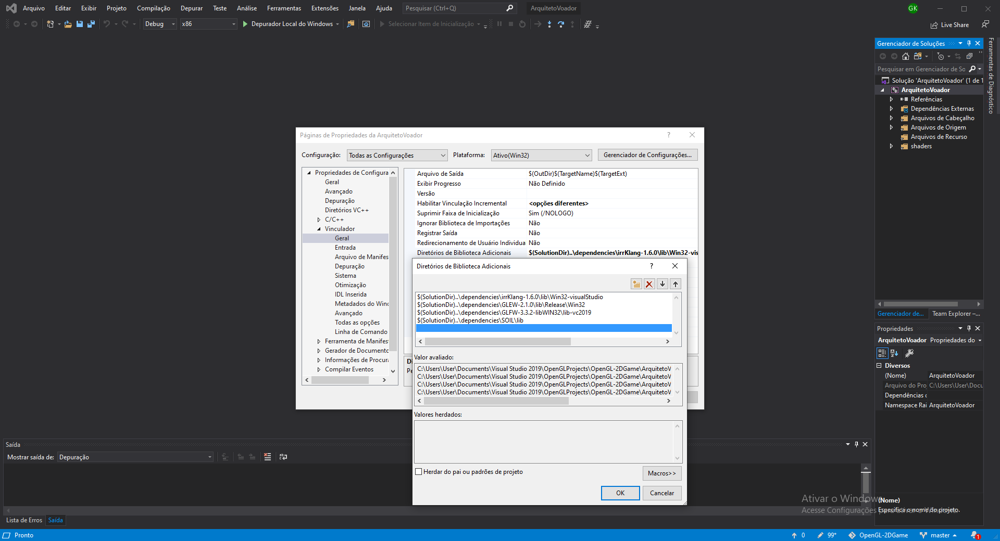

# OpenGL-2DGame
## Arquiteto Voador
Jogo feito em OpenGL para a disciplina de Processamento Gráfico de 2021.

Autores: Gabriel Ely Konrath, Guilherme Closs Fraga e Felipe Veronezi Peters.

Vídeo sobre: https://youtu.be/S7Yv5O_p7Cw

### Instruções para compilar o jogo:
- Fazer o download ou clone do repositório;
- Abrir a solução `ArquitetoVoador.sln` (pode ser encontrada dentro da pasta baixada ou clonada `OpenGL-2DGame-main/ArquitetoVoador`) no Visual Studio 2019;
- Verificar o modo de Debug da solução, este deve estar em `x86` na barra de feramentas superior do Visual Studio. Caso não esteja, deverá ser mudado para `x86`;
- Clicar em `Depurar Local do Windows` na barra de ferramentas superior do Visual Studio ou depurar através do atalho `F5` para executar a aplicação.

OBS.: 
- Caso apareça algum erro de shader, modifique o número versão do core na primeira linha dos arquivos `sprite.frag` e `sprite.vs`, para uma inferior, exemplo: `#version 400 core`, ou menor;
- Caso tenha problema com as dependências, logo depois ao abrir o projeto no VS, faça a configuração do diretório das dependencias em:

Propriedades > C/C++ > Geral > Diretórios de Inclusão Adicionais > ... Adiciocione os diretórios `GLEW/include`, `GLFW/include`, `irrKlang/include`, `SOIL/include` e `/glm` da pasta `/dependencies` deste projeto, como mostra a imagem a seguir;

Propriedades > Vinculador > Geral > Diretórios de Biblioteca Adicionais > ... Adiciocione os diretórios `GLEW/lib`, `GLFW/lib`, `irrKlang/lib` e `SOIL/lib` da pasta `/dependencies` deste projeto, como mostra a imagem a seguir;

Propriedades > Vinculador > Entrada > Dependências Adicionais > ... Adicione as bibliotecas `glfw3.lib`, `glew32s.lib`, `opengl32.lib`, `irrKlang.lib` e `SOIL.lib`, como mostra a imagem a seguir.

### Informações sobre o código:
Código usado é C++ juntamente com o OpenGL e GLSL, e as bibliotecas adicionais GLEW, GLFW, GLM, irrKlang e SOIL.

* ArquitetoVoador: Projeto do jogo 2D foi realizado com base no jogo Breakout do LearnOpenGL, que pode ser encontrado em: https://learnopengl.com/In-Practice/2D-Game/Breakout
